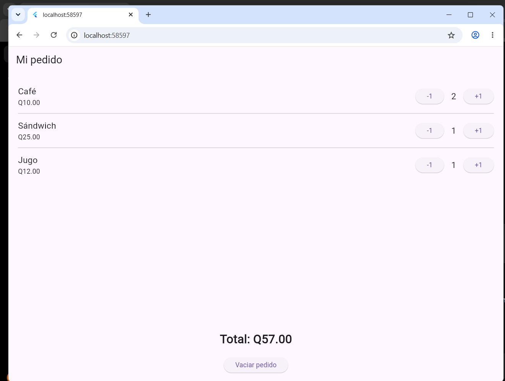

# Laboratorio Mi pedido de cafetería

## Captura

## ¿Cómo calcula el total?

El total se calcula multiplicando el precio de cada producto por la cantidad seleccionada y luego sumando los resultados.

Café: Q10.00 × cantidad  
Sándwich: Q25.00 × cantidad  
Jugo: Q12.00 × cantidad  

Cuando se aumenta o disminuye una cantidad se utiliza `setState`, por lo que el total se actualiza automáticamente.

## ¿Por qué conviene reutilizar ProductoPedido?

Conviene reutilizar `ProductoPedido` porque los tres productos utilizan la misma estructura. Esto evita repetir código y permite cambiar únicamente el nombre, precio, cantidad y las acciones de los botones.