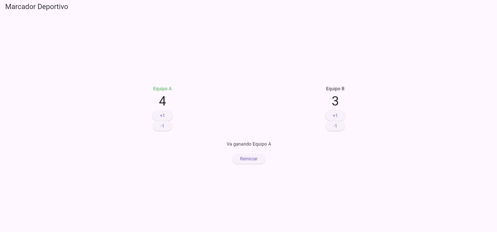
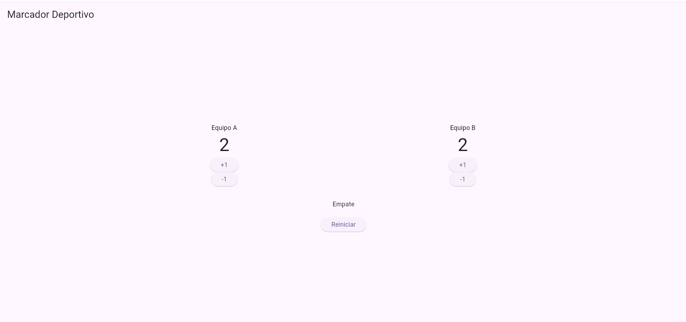

# Laboratorio Marcador Deportivo

Aplicación básica realizada en Flutter para llevar el marcador de dos equipos.

## Funciones

- Sumar goles.
- Restar goles sin bajar de cero.
- Mostrar qué equipo va ganando.
- Mostrar empate.
- Mostrar en verde al equipo que va ganando.
- Reiniciar el marcador.

## Equipo ganando

## Empate

## ¿Qué hace setState?

setState sirve para actualizar la pantalla cuando cambia un dato.

En este programa se utiliza cuando se suman o restan goles y cuando se reinicia el marcador.

Si se cambian los puntos sin utilizar setState, el valor puede cambiar, pero la pantalla no mostraría el cambio inmediatamente.
